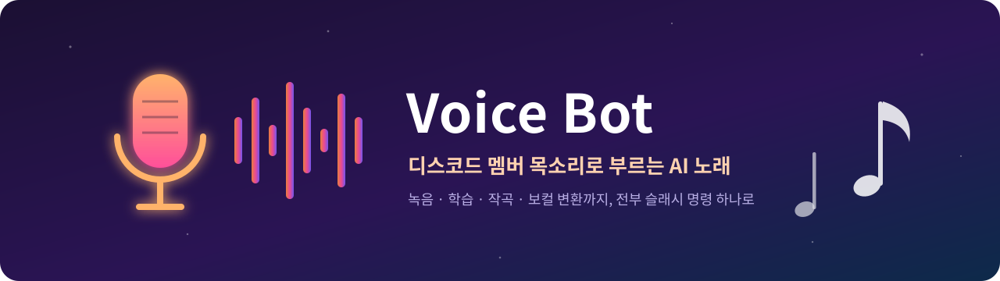
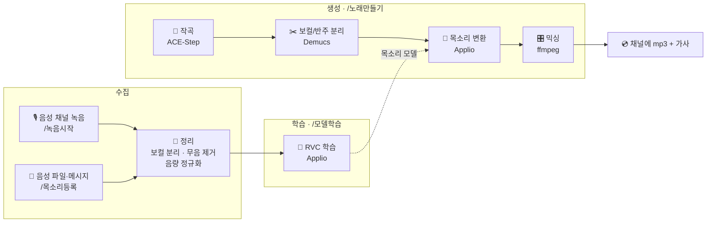

<div align="center">



<br>


**음성 채널에서 수다 떨면, 그 목소리로 노래가 나옵니다.**
동의한 멤버의 목소리를 학습해서, 원하는 장르·분위기·가사로 AI 노래를 만들어 주는 디스코드 봇

[주요 기능](#-주요-기능) · [동작 방식](#-동작-방식) · [명령어](#-명령어) · [빠른 시작](#-빠른-시작) · [개인정보](#-동의와-개인정보)

</div>

---

## ✨ 주요 기능

| | |
|---|---|
| 🎙️ **음성 채널 녹음** | 봇이 음성 채널에 들어와 **사람별로 분리 녹음**. 디스코드 E2EE(DAVE) 환경에서 동작 |
| 🧠 **원클릭 목소리 학습** | `/모델학습` 한 번으로 정리 → 특징 추출 → RVC 학습 → 인덱스 → 연결까지 자동 |
| 🎼 **AI 작곡** | 장르 12종 × 분위기 7종, 가사는 직접 쓰기 / AI 작성 / 연주곡, **레퍼런스 곡** 참고 생성 |
| 🎤 **멤버 목소리로 보컬 교체** | 생성된 곡의 보컬만 분리해서 멤버 목소리로 바꾸고 다시 믹싱 |
| 📋 **안내 패널 · 공지** | 버튼형 사용설명서 패널, 봇 이름으로 올리는 임베드 공지 |
| 🔒 **동의 기반 설계** | 동의한 목소리만 저장, 녹음 중 🔴 표시, `/삭제` 한 번으로 모델까지 전부 삭제 |

---

## 🔄 동작 방식



모든 연산은 **로컬 맥 한 대**(Apple Silicon, MPS/MLX 가속)에서 돌아가며, 작곡과 학습은 하나의 대기열로 순서대로 처리됩니다.

---

## 💬 명령어

<details open>
<summary><b>🚀 시작하기</b></summary>

| 명령 | 설명 |
|---|---|
| `/도움말` | 사용설명서 (나에게만 보임) |
| `/동의` | 목소리 수집·학습·사용에 동의 |
| `/대본` | 녹음할 때 읽을 문장 |

</details>

<details open>
<summary><b>🎙️ 목소리 모으기 · 학습</b></summary>

| 명령 | 설명 |
|---|---|
| `/녹음시작` · `/녹음종료` | 봇이 음성 채널에 들어와 사람별로 녹음 (최대 10분, 채널이 비면 자동 종료) |
| `/목소리등록` | 음성 파일로 샘플 등록. **목소리이름**을 적으면 멤버가 아닌 별도 목소리로 저장 |
| `/내목소리` | 수집 진행률과 모델 준비 여부 |
| `/모델학습` | 모은 녹음으로 목소리 모델 자동 학습 (최소 3분, 권장 10분) |
| `/모델연결` | Applio에서 직접 학습한 모델을 연결 |

</details>

<details open>
<summary><b>🎵 노래 만들기</b></summary>

```
/노래만들기 장르:K-POP 분위기:신나는 가사:AI가 작성 주제:시험 끝난 날 가수:@수현
```

| 옵션 | 선택지 |
|---|---|
| **장르** | K-POP · 발라드 · 힙합 · 락 · 락발라드 · 인디/어쿠스틱 · R&B · 시티팝 · EDM · 로파이 · 트로트 · 재즈 |
| **분위기** | 신나는 · 감성적인 · 잔잔한 · 슬픈 · 웅장한 · 몽환적인 · 유쾌한 |
| **가사** | 직접 입력(입력창) · AI가 작성 · 연주곡 |
| **가수 / 목소리** | 멤버 또는 별도 등록한 목소리 |
| **방식** | 새로 생성 · 레퍼런스 참고(음악 파일 첨부) |
| 기타 | 보컬 성별 · 길이(30~180초) · 추가 스타일 · 키 조절(±12) |

`/가수목록`으로 지금 부를 수 있는 가수를 확인할 수 있어요.

</details>

<details>
<summary><b>🛠️ 관리</b></summary>

| 명령 | 설명 |
|---|---|
| `/안내` | (관리자) 버튼형 소개 패널 게시 · 재시작 후에도 버튼 유지 |
| `/공지` | (관리자) 봇 이름으로 임베드 공지 게시 |
| `/삭제` | 내 녹음·모델·동의 기록 + 내가 등록한 별도 목소리 전부 삭제 |
| `/목소리삭제` | 내가 등록한 별도 목소리 삭제 |

</details>

---

## 🚀 빠른 시작

> 테스트 환경: macOS (Apple Silicon, M4 Pro 24GB), Python 3.11. 여유 저장 공간 **20GB 이상** 권장

**1. 도구 설치**

```bash
brew install python@3.11 ffmpeg opus git
```

**2. 봇 환경**

```bash
git clone https://github.com/<you>/voice-bot.git && cd voice-bot
conda create -n voicebot python=3.11 -y && conda activate voicebot
pip install -r requirements.txt -r requirements-ml.txt
cp .env.example .env    # 토큰과 서버 ID 입력
```

**3. 작곡·학습 엔진** (홈 폴더에 설치)

```bash
cd ~ && git clone https://github.com/ace-step/ACE-Step-1.5.git
cd ~ && git clone https://github.com/IAHispano/Applio.git && cd Applio && ./run-install.sh
```

> `bad interpreter: /bin/bash^M` 에러가 나면 해당 폴더에서 `perl -pi -e 's/\r$//' *.sh`

**4. 디스코드 설정**

- Developer Portal → Bot → **Message Content Intent** 켜기
- OAuth2 URL Generator
  - Scopes: `bot`, `applications.commands`
  - Permissions: View Channels · Send Messages · Embed Links · Attach Files · Read Message History · Add Reactions · Connect

**5. 실행**

```bash
./start.sh    # 작곡 서버 + 봇을 함께 실행, 맥 잠자기 방지 · Ctrl+C로 함께 종료
```

<details>
<summary><b>⚙️ 환경 변수 (.env)</b></summary>

| 변수 | 설명 | 기본값 |
|---|---|---|
| `DISCORD_TOKEN` | 봇 토큰 | (필수) |
| `GUILD_IDS` | 명령어를 즉시 등록할 서버 ID (쉼표 구분) | 전역 등록 |
| `REGISTER_CHANNEL_ID` | 음성 메시지 자동 등록 채널 | 없음 |
| `DATA_DIR` | 녹음·모델·노래 저장 위치 | `data` |
| `MAX_RECORD_MINUTES` | 음성 채널 녹음 최대 시간 | `10` |
| `ACESTEP_URL` | 작곡 서버 주소 | `http://127.0.0.1:8001` |
| `APPLIO_DIR` | Applio 설치 경로 | `~/Applio` |
| `SONG_TIMEOUT_SECONDS` | 작곡 최대 대기 시간 | `1200` |

</details>

<details>
<summary><b>📁 프로젝트 구조</b></summary>

```
voice-bot/
├── bot.py              # 디스코드 봇: 명령어, 음성 녹음, 작업 대기열, 안내 패널
├── music.py            # 노래 파이프라인: 작곡 → 보컬 분리 → 목소리 변환 → 믹싱
├── trainer.py          # 목소리 모델 자동 학습 (Applio CLI 제어)
├── preprocess.py       # 녹음 정리: 보컬 분리 · 무음 제거 · 음량 정규화 · 분할
├── start.sh            # 작곡 서버 + 봇 동시 실행
├── requirements.txt    # 봇 (py-cord 개발 브랜치 고정)
├── requirements-ml.txt # 오디오 처리 (torch, demucs, librosa …)
├── assets/             # README 이미지
└── data/               # (git 제외) 동의 기록 · 녹음 · 데이터셋 · 모델 · 노래
```

</details>

---

## 🔒 동의와 개인정보

목소리는 그 사람의 것이라는 원칙으로 설계했습니다.

- **옵트인**: `/동의`한 멤버의 목소리만 저장합니다. 녹음 중에도 미동의자의 음성은 메모리에서 바로 버립니다.
- **투명성**: 녹음을 시작하면 채널에 🔴 표시와 함께 저장 대상과 제외 대상을 알립니다.
- **별도 목소리**: 멤버가 아닌 목소리는 등록자가 **본인 목소리이거나 주인의 허락을 받았음**을 확인해야 만들 수 있고, 등록자만 관리할 수 있습니다.
- **삭제권**: `/삭제` 한 번으로 녹음, 데이터셋, 학습 모델, 동의 기록이 모두 지워집니다.
- **로컬 보관**: 모든 데이터는 운영자의 맥에만 저장되며 `data/`는 저장소에 올라가지 않습니다.

---

## ⚠️ 알려진 제약

- **음성 채널 녹음은 실험 기능**입니다. 2026년 3월 디스코드의 음성 E2EE(DAVE) 전면 적용 이후 공식 py-cord 릴리스에서 음성 수신이 동작하지 않아, 수정 중인 개발 브랜치(`fix/voice-rec-2`)의 특정 커밋을 사용하고 알려진 keepalive 버그([#3388](https://github.com/Pycord-Development/pycord/issues/3388))를 코드에서 우회합니다.
- 봇은 **운영자의 맥이 켜져 있을 때만** 동작합니다.
- 작곡과 학습은 한 번에 하나씩 처리되어, 학습 중에는 노래 요청이 대기합니다.
- AI 가사는 작곡 모델에 내장된 소형 언어 모델이 작성해 한국어 완성도가 들쭉날쭉할 수 있습니다.

---

## 🗺️ 로드맵

- [x] 동의 · 음성 채널 녹음 · 파일 등록
- [x] 자동 전처리와 원클릭 목소리 학습
- [x] 작곡 → 보컬 교체 → 믹싱 파이프라인
- [x] 레퍼런스 곡 참고 생성 · 별도 목소리
- [x] 버튼형 안내 패널 · 임베드 공지
- [ ] 여러 멤버가 파트를 나눠 부르는 **듀엣/단체곡**
- [ ] 완성곡을 음성 채널에서 바로 재생
- [ ] 공식 py-cord 릴리스로 녹음 기능 이전

---

## 🙏 사용한 오픈소스

| 프로젝트 | 역할 | 라이선스 |
|---|---|---|
| [Pycord](https://github.com/Pycord-Development/pycord) | 디스코드 봇 · 음성 수신 | MIT |
| [ACE-Step 1.5](https://github.com/ace-step/ACE-Step-1.5) | 가사 → 노래 생성 | MIT |
| [Applio](https://github.com/IAHispano/Applio) | RVC 목소리 학습 · 변환 | MIT |
| [Demucs](https://github.com/facebookresearch/demucs) | 보컬/반주 분리 | MIT |
| [librosa](https://github.com/librosa/librosa) · [pyloudnorm](https://github.com/csteinmetz1/pyloudnorm) | 오디오 분석 · 음량 정규화 | ISC · MIT |
| [FFmpeg](https://ffmpeg.org) | 오디오 변환 · 믹싱 | LGPL/GPL |

<div align="center">
<sub>동의한 목소리로만, 친구들끼리 즐겁게 🎶</sub>
</div>
